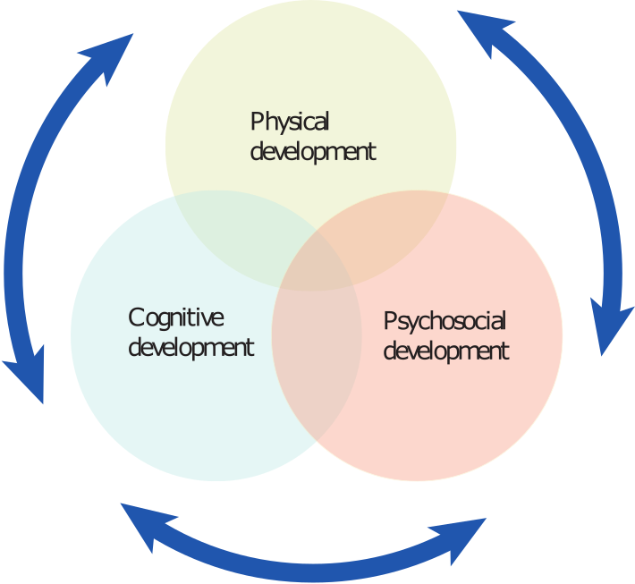
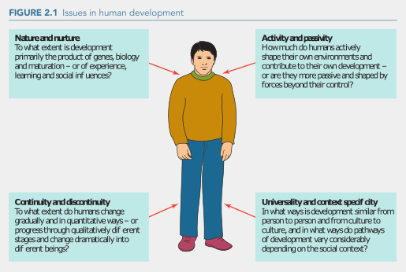

## How should we think about Human Development

### Defining Development
  
Systematic changes and continuities (ways in which we remain the same or reflect elements of our past selves) in the individual that occur between conception and death.  

Development falls into 3 broad areas:
  
1. _Physical Development_: Relates to genetic inheritance, growth of the body and organs, functioning of physiological systems, physical signs of ageing and changes in motor functions, etc.
2. _Cognitive Development_: The development of mental processes, such as perception, attention, language. learning, memory. intelligence, creativity and problem solving.
3. _Psychosocial Development_: Aspects of the self, and social and interpersonal interactions, such as motives, emotions, personality traits, morality, social skills, and roles played in the family (miniature social experiment) and larger society.
			

		
These areas overlap, providing opportunities to contribute to each other. In the case of a baby learning to crawl _(physical)_, opportunity is then available for the child to grow by exploring their environment _(cognitive)_ as well as watching     different family members interact _(psychosocial)_ and go about their day.  
		
While physical development generally follows the growth-stability-loss model into old age, the belief that all 3 aspects of this development cycle follow the same pattern is largely false, although there are some connections in all three areas via this model.  
		
Developmental change at any age involves both gain and loss. While we gain cognitive abilities as children, we also become less willing to be flexible in our thinking as we age. There may also be a loss of self esteem and a susceptibility to depression. Examples of continued gain into old age is vocabulary, and accumulated knowledge over the lifespan.  

***

### Conceptualising the lifespan

Developmentalists largely agree on defined periods of development, in which similar markers can be attributed. 

__Period of Life__  | __Age Range__
------------- | -------------
Prenatal period  | Conception to birth
Infancy  | First 2 years of life (the first month is referred to as the neonatal or newborn period)
Early childhood  | 2 to 5 or 6 years (some refer to children aged 1 to 3 who have begun to walk as toddlers)
Middle childhood  | 6 to about 12 years (or the onset of puberty)
Adolescence  | Approximately 12 to 18 or 20 years (or when the individual becomes relatively independent of parents and begins to assume adult roles)
_Emerging adulthood_  | _18 to 25 or even 29 years (transitional period between adolescence and adulthood)_
Early adulthood  | 20 to 40 years
Middle adulthood  | 40 to 65 years
Late adulthood  | 65 years and older (some refer to subcategories within this period, such as the young old, old old, and very old, based on age ranges or differences in functioning)

The emerging adulthood period has recently been added, but not universally agreed upon by researchers.  

Emerging adulthood is characterised by:  

* exploring identity
* instability: job, relationship, living changes
* free of obligations to focus on own needs.
* "in between" adolescence and adulthood.
* belief in limitless possibilities ahead.

The 5 traditional markers of adulthood are education, financial independence, leaving home, marrying and having children.  

The challenge with the use of these markers is that some individuals take longer than others (e.g. - father at 40) to reach them, while others do not pursue these markers at all. Different sections of society view these markers differently, and do not necessarily agree that they are universal for all individuals and cultures.  

#### Age and Development: Sociocultural perspectives

__Culture__ is defined as he shared way of life of a people. We learn a system of beliefs, values and practices considered to be relevant in order to function as a part of our culture into adulthood. Culture influences how we live and experience life.  

Cultures segregate groups within their societies based on __age grade__ or __age stratum__. For example, children in year levels at school, retirement age at 65, getting a license to drive at 18 (as well as voting, and consuming alcohol). Each culture has its own way of doing this, and whole societies are layered into age grades. Age grade can change over time, such as the eligibility for the pension, or other cultures defining age grade as a function of motility as the number of years since birth is not accurately recorded.  

__Age norms__ are also defined within cultures to appropriate behaviours. For example, a 6 year old should not drink beer, we should many in our 20s and 30s and should retire at around 65.  
The __social clock__ is a concept used to describe when certain life events should take place such as marriage, parenthood or retirement. These events can negatively impact an individual when they occur __"off-time"__ (parent after 40), although western based cultures have seen a weakening of age norms.  

__Stereotypes__ and __ageism__ are concepts that come about as a result of important life events occurring outside age norms, as they are deemed inappropriate by a culture or society. Examples of these include elderly people seeking employment or education in a prejudicial sense, or the positive assumption that older people will be able to offer advice or assistance in certain situations. Ageism can also be detrimental to children if they are considered to be too young to speak for themselves.  

The above concepts also differ from one culture to another, based on race or __ethnicity__, __socioeconomic status (SES)__, or __standing in society__ (education, income, or occupational prestige), with members of these stratum often having very different developmental experiences, and poverty being highlighted as significantly detrimental to human development. 

#### Age and development: Sociohistorical perspectives
### Framing the influence of nature and nurture

***

## What is the science of lifespan development?

### Goals of Study
### Early Beginnings
### The Modern Life Span Perspective

***

## Developmental Theories and the Issues that they raise. {.tabset}

### Nature Vs. Nurture

The nature argument posits that our development is purely based on genetics, and the evolutionary process, and holds that most developmental milestones are universal. 

The nurture argument posits that our physical (crowding, pollution, etc.) and social environments (friends, family, society and culture) play a primary role in our development over the course of a lifetime.

### Activity and Passivity

Playing an active role in the progress of our own development such as self directed learning and curiosity, and manifesting our own development, which, in turn, assists in furthering our development.

Passivity is determined as an external forces beyond an individual's control shaping their development, suggesting that a child's academic failings may be the responsibility of parents and/or teachers.

### Continuity and Disconinuity

This issue looks at the gradual and quantitative modes (continuity) of development such as the visible signs of ageing, as opposed to larger, qualitative changes (discontinuity) such as growth spurts, and other changes at puberty.

### Universality and Context Specificity

Universality posits that development is uniform across cultures and groups, while context specificity contends that development markers and milestones differ between families, cultures and groups. 

### Summary

## {-}