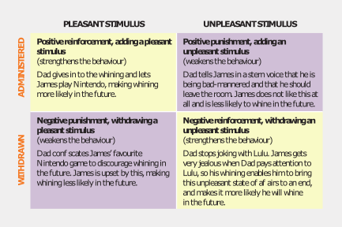

```{r setup, include=FALSE}
knitr::opts_chunk$set(echo = TRUE)
library(DiagrammeR)
```

## Theories {.tabset}

### Psychoanalytic

#### Freud: Psychoanalytic theory

>_The id communicates its basic needs, the ego restrains the impulsive id long enough to find realistic ways to satisfy these needs, and the superego decides whether the ego’s problem-solving strategies are morally acceptable._
>
>**Psychoanalytic Theory**: The theoretical perspective that emphasises the >importance of unconscious motivations, emotional conflicts and early experiences >for shaping personality and behaviour.
>
>**Instincts**: Inborn biological forces assumed to motivate behaviour.
>
>**Unconscious Motivation**: The power of instincts and other inner forces, such >as feelings and conflicts, which influence thinking and behaviour without >awareness.
>
>**id**: The inborn component of the personality that is driven by impulsive, >irrational and selfish urges.
>
>**ego**: The rational component of the personality that seeks to satisfy urges >in a realistic manner.
>
>**superego**: The component of the personality that consists of the individual’s >internalised moral standards.
>
>**libido**: Psychic energy of the sex instinct.
>
>**psychosexual stages**: Freud’s five stages of development (oral, anal, >phallic, latency and genital) associated with biological maturation and shifts >in the libido.
>
>**identification**: with same sex parent – by taking on his mother / father’s >attitudes and behaviours, which are part of the superego.
>
>**fixation**: Defence mechanism in which development is arrested and part of the >libido remains tied to an early stage of development (arrested development).
>
>**Oedipus / Electra Complex**: Psychic conflict that 3 - 6 year old boys/girls >experience when they develop an incestuous desire for their mothers/fathers and >a jealous and hostile rivalry with their fathers.
>
>**Regression**: A defence mechanism (similar to fixation or identification) of >retreating to an earlier period of development to avoid anxiety and discomfort >at a higher level, allowing us to function despite anxiety.


#### Erikson: Psychosocial theory

> In contrast to Freud's theory, Erikson focussed more on:
>
> - the social impact of development rather than sexual,
> - rational development rather than selfish and irrational,
> - activity and the ability for people to adapt to, or overcome damaging early experiences, and
> - the notion that development continued after adolescence.
>

> In comparison to Freud:
>
> _"Upward in consciousness, outward to the social world and forward throughout the lifespan"_
>

> **psychosocial stages**: Erikson’s eight stages of development (trust, autonomy, initiative, industry, identity, intimacy, generativity and integrity), which emphasise social over maturational influences as drivers of development.


#### Psychoanalytic theories: Side by Side
> |            | Freud's Psychosexual Stages |                                                                                                                                                                      | Erikson's Psychosocial Stages |                                                                                                                                                                                |
> |:----------:|:---------------------------:|----------------------------------------------------------------------------------------------------------------------------------------------------------------------|:-----------------------------:|--------------------------------------------------------------------------------------------------------------------------------------------------------------------------------|
> | Age Range  | Stage                       | Description                                                                                                                                                          | Stage                         | Description                                                                                                                                                                    |
> | Birth to 1 | Oral                        | Libido is focused on the mouth as a source of pleasure. Obtaining oral gratification from a mother figure is critical to later development.                          | Trust vs mistrust             | Infants must learn to trust their caregivers to meet their needs. Responsive parenting is critical.                                                                            |
> | 1 to 3     | Anal                        | Libido is focused on the anus, and toilet training creates conflicts between the child’s biological urges and society’s demands.                                     | Autonomy vs shame and doubt   | Children must learn to be autonomous (to assert their wills and do things for themselves) or they will doubt their abilities.                                                  |
> | 3 to 6     | Phallic                     | Libido centres on the genitals. Resolution of the Oedipus or the Electra complex results in identification with the same-sex parent and development of the superego. | Initiative vs guilt           | Preschoolers develop initiative by devising and carrying out bold plans, but they must learn not to impinge on the rights of others.                                           |
> | 6 to 12    | Latent                      | Libido is quiet; psychic energy is invested in schoolwork and play with same-sex friends.                                                                            | Industry vs inferiority       | Children must master important social and academic skills and keep up with their peers; otherwise, they will feel inferior.                                                    |
> | 12 to 20   | Genital                     | Puberty reawakens the sexual instincts as youths seek to establish mature sexual relationships and pursue the biological goal of reproduction.                       | Identity vs role confusion    | Adolescents ask who they are and must establish social and vocational identities; otherwise, they will remain confused about the roles they should play as adults.             |
> | 20 to 40   |                             |                                                                                                                                                                      | Intimacy vs isolation         | Young adults seek to form a shared identity with another person, but may fear intimacy and experience loneliness and isolation.                                                |
> | 40 to 65   |                             |                                                                                                                                                                      | Generativity vs stagnation    | Middle-aged adults must feel that they are producing something that will outlive them, either as parents or as workers; otherwise, they will become stagnant and self-centred. |
> | 65+        |                             |                                                                                                                                                                      | Integrity vs despair          | Older adults must come to view their lives as meaningful to face death without worries and regrets.                                                                            |

### Learning

#### Pavlov and Watson: Classical conditioning

> 

#### Skinner: Operant conditioning

> **Positive Reinforcement**: The process in operant conditioning whereby a desirable event, when introduced following a behaviour, makes that behaviour more probable in the future.
>
> **Negative Reinforcement**: The process in operant conditioning whereby something unpleasant is removed following a behaviour, which makes that behaviour more probable in the future.
>
> **Positive Punishment**: The process in operant conditioning whereby something unpleasant is applied or added to the situation following a behaviour, which makes that behaviour less probable in the future.
>
> **Negative Punishment**: The process in operant conditioning whereby something desirable is removed following a behaviour, which makes that behaviour less probable in the future.
>
> **Extinction**: The gradual weakening and disappearance of a learned response when it is no longer reinforced.
>
> 

#### Bandura: Social cognitive theory

>**Social Cognitive Theory**: A process in which humans actively consider their behaviours and the outcomes of such behaviours. The perceived outcomes of their behaviours and the consequences are motivations towards modifying, intensifying or abandoning particular behaviours. Self congratulation or self criticisms can also modify behaviours.
>
>**observational learning**: Learning that results from observing the behaviour of other people. (e.g. Mayan children vs American children)
>
>**latent learning**: Learning that occurs from observation but is not evident in behaviour. Observed consequences can be a deterrent to particular behaviours.
>
>**vicarious reinforcement**: A process in observational learning in which learners become more or less likely to perform a behaviour based on whether consequences experienced by the model they observe are reinforcing or punishing.
>
>**self-efficacy**: The belief that one can effectively produce desired outcomes in a particular area of life.
>
>**reciprocal determinism**: The notion in social cognitive theory that human development is shaped by the continuous interaction between the person, the person’s behaviour and their environment. People choose, build and change their environments; they are not just shaped by them.
>
>```{r echo = FALSE}
mermaid("
graph LR;
  A[Person]
  B[Behaviour]
  C[Environment]

  A --> B
  B --> C
  C --> A
")
>```

#### Summary
>|  Learning theorist  							 						 					 |  						  							  								 Type of learning  							 						 					       |  						  							  								 What it involves  							 						 					                                                                                                                 |  						  							  								 What is learned  							 						 					                                                                                                     |
>|-----------------------------|----------------------------------|--------------------------------------------------------------------------------------------------------------------------------------------|-------------------------------------------------------------------------------------------------------------------------------|
>|  						  							  								 John Watson  							 						 					       |  						  							  								 Classical conditioning  							 						 					 |  						  							  								 A stimulus comes to elicit a response through its association with an unconditioned stimulus.  							 						 					                                    |  						  							  								 Emotional reactions (e.g. pleasant associations, phobias)  							 						 					                                                           |
>|  						  							  								 B. F. Skinner  							 						 					     |  						  							  								 Operant conditioning  							 						 					   |  						  							  								 Learning involves reacting to the consequences of one’s behaviour (reinforcement and punishment).  							 						 					                                |  						  							  								 Skills; good and bad habits  							 						 					                                                                                         |
>|  						  							  								 Albert Bandura  							 						 					    |  						  							  								 Observational learning  							 						 					 |  						  							  								 Learning occurs through vicarious reinforcement or punishment by watching a model and the consequences of the model’s behaviour.  							 						 					 |  						  							  								 Skills, cognitions and behaviours, including ones  that the learner has not been directly reinforced for displaying  							 						 					 |

### Cognitive

#### Piaget: Cognitive developmental theory

>**cognitive developmental theory**: Piaget’s theory of development which emphasises the role of experience and active exploration interacting with biological maturation as the drivers for cognitive development.
>
>| Age range          | Stage               | Description                                                                                                                                                                                                                                                                                                                                 |
|--------------------|---------------------|---------------------------------------------------------------------------------------------------------------------------------------------------------------------------------------------------------------------------------------------------------------------------------------------------------------------------------------------|
>| Birth - 2         | Sensorimotor        | Infants use their senses and motor actions to explore and understand the world. At the start they have only innate reflexes, but they develop increasingly ‘intelligent’ actions. By the end, they are capable of symbolic thought using images or words and can therefore mentally plan solutions to problems.                             |
>| 2 - 7             | Preoperational      | Preschoolers use their capacity for symbolic thought to develop language, engage in pretend play and solve problems. But their thinking is not yet logical; they are egocentric (unable to take others’ perspectives) and are easily fooled by perceptions, failing ‘conservation’ problems because they cannot rely on logical operations. |
>| 7 - 11            | Concrete Operations | School-age children acquire concrete logical operations that allow them to mentally classify, add and otherwise act on concrete objects in their heads. They can solve practical, real-world problems through a trial-and-error approach but have difficulty with hypothetical and abstract problems.                                       |
>| 11 - 12+ | Formal Operations   | Adolescents can think about abstract concepts and purely hypothetical possibilities and can trace the long- range consequences of possible actions. With age and experience, they can form hypotheses and systematically test them using the scientific method.                                                                             |
>
>**constructivism**: The position that humans actively create their own understandings of the world from their experiences, as opposed to being born with innate ideas or being programmed by the environment.
>

#### Vygotsky: Sociocultural theory
>
>**sociocultural theory**: Vygotsky’s theory of development, which emphasises the role of the social and cultural context for cognitive development.
>
>**social constructivism**: The position that humans actively create their own understandings of the world from their social interactions and exposure to cultural tools such as language.

## {-}

***